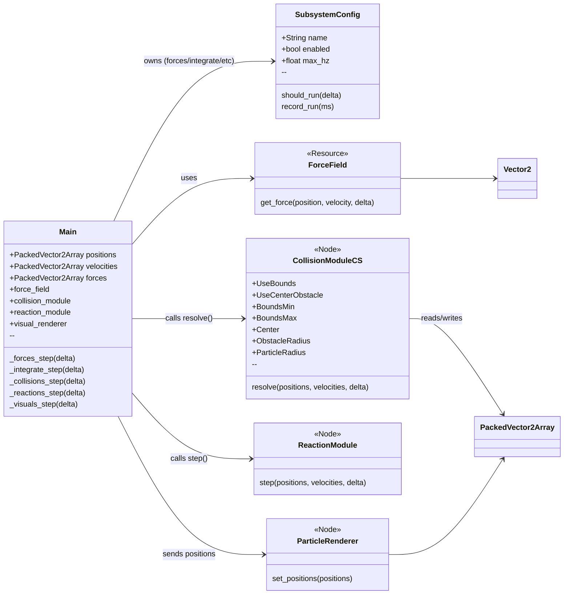

```mermaid
classDiagram
    direction LR

    %% =========================
    %% Core World / Main Loop
    %% =========================
    class Main {
        +PackedVector2Array positions
        +PackedVector2Array velocities
        +PackedVector2Array forces
        +force_field
        +collision_module
        +reaction_module
        +visual_renderer
        --
        _forces_step(delta)
        _integrate_step(delta)
        _collisions_step(delta)
        _reactions_step(delta)
        _visuals_step(delta)
    }

    %% =========================
    %% Subsystem Configuration
    %% =========================
    class SubsystemConfig {
        +String name
        +bool enabled
        +float max_hz
        --
        should_run(delta)
        record_run(ms)
    }

    Main --> SubsystemConfig : owns (forces/integrate/etc)

    %% =========================
    %% Forces
    %% =========================
    class ForceField {
        <<Resource>>
        get_force(position, velocity, delta)
    }

    Main --> ForceField : uses

    %% =========================
    %% Collisions
    %% =========================
    class CollisionModuleCS {
        <<Node>>
        +UseBounds
        +UseCenterObstacle
        +BoundsMin
        +BoundsMax
        +Center
        +ObstacleRadius
        +ParticleRadius
        --
        resolve(positions, velocities, delta)
    }

    Main --> CollisionModuleCS : calls resolve()

    %% =========================
    %% Reactions
    %% =========================
    class ReactionModule {
        <<Node>>
        step(positions, velocities, delta)
    }

    Main --> ReactionModule : calls step()

    %% =========================
    %% Rendering
    %% =========================
    class ParticleRenderer {
        <<Node>>
        set_positions(positions)
    }

    Main --> ParticleRenderer : sends positions

    %% =========================
    %% Godot Data Types
    %% =========================
    class PackedVector2Array
    class Vector2

    CollisionModuleCS --> PackedVector2Array : reads/writes
    ForceField --> Vector2
    ParticleRenderer --> PackedVector2Array
```
